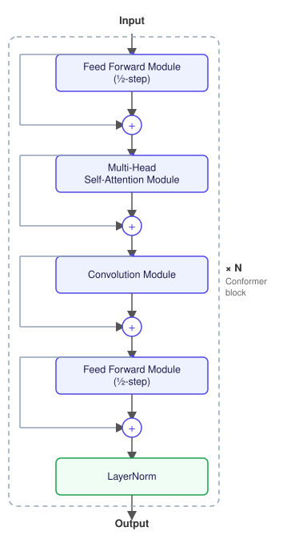

<p align="center">
  
  <br>
  <sub><a href="https://arxiv.org/abs/2005.08100">Conformer: Convolution-augmented Transformer for Speech Recognition</a></sub>
</p>

# Conformer Training Pipeline

Fine-tune a pretrained [NVIDIA NeMo](https://github.com/NVIDIA/NeMo) FastConformer Hybrid (CTC + RNNT) model on a new language — download data, train a tokenizer, fine-tune, evaluate.

Built around Mozilla's [Common Voice](https://commonvoice.mozilla.org/) (via the [Mozilla Data Collective](https://mozilladatacollective.com/) API), [OpenSLR-53](https://www.openslr.org/53/) (Bengali), and Google's [FLEURS](https://huggingface.co/datasets/google/fleurs) — but the tokenizer/train/eval stages work with any manifest-based dataset in NeMo's JSON-lines format.

```
┌─────────────────┐     ┌────────────────────┐     ┌───────────┐     ┌───────────────┐
│ prepare_data.py │     │ build_tokenizer.py │     │ train.py  │     │ eval.py       │
│ download +      │  →  │ SentencePiece      │  →  │ fine-tune │  →  │ WER/CER on    │
│ build manifests │     │ BPE/unigram        │     │ CTC+RNNT  │     │ held-out test │
└─────────────────┘     └────────────────────┘     └───────────┘     └───────────────┘
```

Every stage is a thin CLI (`--config`, defaults to `config.yaml`) over core logic in [`src/`](src/). Each script reads only its own top-level section of the config, which is the single source of truth for all settings.

## Quick start

Each `pipeline*.sh` script runs the same five steps end to end:

```
git clone/pull  →  install deps  →  prepare_data.py  →  data_stats.py  →  train.py
```

Pick the command for where you're running:

**Dedicated GPU server**

```bash
curl -fsSL https://raw.githubusercontent.com/sayedshaun/conformer-training-pipeline/main/pipeline.sh | bash
```

**Kaggle notebook**

```bash
!curl -fsSL https://raw.githubusercontent.com/sayedshaun/conformer-training-pipeline/main/pipeline_kaggle.sh | bash
```

**Colab notebook**

```bash
!curl -fsSL https://raw.githubusercontent.com/sayedshaun/conformer-training-pipeline/main/pipeline_colab.sh | bash
```

`pipeline.sh` uses a `venv`, falling back to the system Python if venv creation fails. `pipeline_kaggle.sh`/`pipeline_colab.sh` skip venv entirely and `--force-reinstall` into the system environment, since both platforms preinstall their own torch/CUDA stack and often have a broken `venv`/`ensurepip`.

## Setup

```bash
python -m venv venv && source venv/bin/activate
pip install -r requirements.txt
echo "MDC_API_KEY=your-key-here" >> .env   # only needed for the mcv source
```

Requires Python 3.12 and an NVIDIA GPU. The `mcv` data source needs a [Mozilla Data Collective](https://mozilladatacollective.com/) API key unless `skip_download: true` is set; `openslr` and `fleurs` need no key. The `mcv` dataset also requires accepting its terms once on the [MDC dataset page](https://mozilladatacollective.com/datasets/cmqim44fo00tinr07mbu70eg7) before the API will serve a download.

<details>
<summary><b>Setting MDC_API_KEY on Kaggle / Colab</b></summary>

<br>

A plain `.env` file doesn't persist across Kaggle/Colab sessions, so set the key as an environment variable in a notebook cell before running the pipeline command.

**Kaggle** — use Kaggle's built-in Secrets manager so the key isn't stored in the notebook itself:

1. **Add-ons** menu (top bar) → **Secrets** → **Add a new secret**, label it `MDC_API_KEY`, paste your key, save.
2. Toggle the secret **on** for the current session in that same panel.
3. In a cell, before the pipeline command:
   ```python
   from kaggle_secrets import UserSecretsClient
   import os
   os.environ["MDC_API_KEY"] = UserSecretsClient().get_secret("MDC_API_KEY")
   ```
4. Then run the pipeline (same or a later cell — env vars set in Python persist for the rest of the kernel session, including `!` shell commands):
   ```python
   !curl -fsSL https://raw.githubusercontent.com/sayedshaun/conformer-training-pipeline/main/pipeline_kaggle.sh | bash
   ```

**Colab** — use Colab's Secrets panel (the key icon in the left sidebar):

1. Click the **key icon** in the left sidebar → **Add new secret**, name it `MDC_API_KEY`, paste your key.
2. Toggle **Notebook access** on for it.
3. In a cell, before the pipeline command:
   ```python
   from google.colab import userdata
   import os
   os.environ["MDC_API_KEY"] = userdata.get("MDC_API_KEY")
   ```
4. Then run the pipeline:
   ```python
   !curl -fsSL https://raw.githubusercontent.com/sayedshaun/conformer-training-pipeline/main/pipeline_colab.sh | bash
   ```

Quicker but less safe on either platform (key sits in plain text in the notebook — avoid if you'll share/publish it):
```python
import os
os.environ["MDC_API_KEY"] = "your-actual-key-here"
```

</details>

<details>
<summary><b>GPU / CUDA version</b></summary>

<br>

`requirements.txt` pins `torch` to a **CUDA 12.8** wheel and `numba-cuda` to `0.15.1`. NVIDIA drivers are backward-compatible, so any driver supporting CUDA 12.8+ (check with `nvidia-smi`) works unchanged. Only a driver **older** than 12.8 needs a swap:

```diff
- --extra-index-url https://download.pytorch.org/whl/cu128
+ --extra-index-url https://download.pytorch.org/whl/cu126
- numba-cuda[cu12]==0.15.1
+ numba-cuda[cu11]==0.15.1
- torch==2.11.0+cu128
+ torch==2.7.1+cu126
```

```bash
pip install --force-reinstall -r requirements.txt
python -c "import torch; print(torch.version.cuda)"
```

`torch` and `numba-cuda` must always target the same CUDA major version — they share the `cuda-bindings` dependency, pinned per-major-version by each, so mismatched majors fail dependency resolution.

`numba-cuda` is held at `0.15.1` specifically because later releases hit an `nvJitLink` linker error (`ERROR 4 in nvvmAddNVVMContainerToProgram`) inside NeMo's RNNT loss kernel. `0.15.1` only ships `cu11`/`cu12` extras — no `cu13`.

</details>

## Usage

```bash
python prepare_data.py     # 1. download + build train/dev/test manifests
python build_tokenizer.py  # 2. train a SentencePiece tokenizer
python train.py            # 3. fine-tune the pretrained model
python eval.py             # 4. WER/CER on the held-out test set
```

Idempotent where it makes sense: `prepare_data.py` skips splits whose manifest already exists and resumes partial downloads. `train.py`/`build_tokenizer.py` always start fresh.

| Script | Config section | Purpose |
|---|---|---|
| `prepare_data.py` | `data:` | Dataset download + manifest generation |
| `build_tokenizer.py` | `tokenizer:` | SentencePiece tokenizer training |
| `train.py` | `train:` | Model fine-tuning |
| `eval.py` | `eval:` | WER/CER evaluation |

See [`config.yaml`](config.yaml) for the full set of keys and defaults.

<details>
<summary><b>1. Data preparation</b></summary>

<br>

`prepare_data.py` runs each source listed under `data.sources` and merges the results into one set of manifests:

- **`mcv`** ([`src/mcv.py`](src/mcv.py)) — downloads a Common Voice release via the Mozilla Data Collective API (resumable, retried on stalled connections) and builds `train`/`dev`/`test` manifests from Common Voice's own validated splits (`validated.tsv`, `dev.tsv`, `test.tsv`; invalidated/other clips are never used).
- **`openslr`** ([`src/openslr.py`](src/openslr.py)) — downloads the OpenSLR-53 Bengali corpus (16 zip shards) and builds manifests from every utterance in `utt_spk_text.tsv`. No official split exists, so a random `dev_utterances`/`test_utterances` sample (fixed seed) is held out and the rest becomes train.
- **`fleurs`** ([`src/fleurs.py`](src/fleurs.py)) — pulls all of `bn_in`'s splits from [google/fleurs](https://huggingface.co/datasets/google/fleurs) and folds them all into `train` (safe from contamination since dev/test already come from `mcv`/`openslr`).

Each source converts clips to 16kHz mono WAV under `output_dir/wavs/` and writes its own `{name}_{split}_manifest.json`; these get concatenated per-split into the final `train_manifest.json` / `dev_manifest.json` / `test_manifest.json`.

If a source's corpus is already extracted locally, set `skip_download: true` (globally or per source) and point `output_dir` at it. For `openslr`, `shards` can be trimmed to a subset (e.g. `["0", "1"]`) instead of `all` for a quick trial.

</details>

<details>
<summary><b>2. Tokenizer</b></summary>

<br>

Trains a SentencePiece tokenizer (BPE or unigram) over the given manifests' text and lays out the result the way NeMo's `ASRBPEMixin` expects (`tokenizer.model`, `tokenizer.vocab`, `vocab.txt`).

</details>

<details>
<summary><b>3. Training</b></summary>

<br>

Loads a pretrained FastConformer Hybrid checkpoint from NVIDIA's model registry, swaps in the target-language tokenizer via `change_vocabulary`, and fine-tunes with PyTorch Lightning:

- Encoder freezing for the first N steps (`freeze_encoder_steps`), then automatic unfreezing
- Gradient accumulation and mixed precision
- Weights & Biases logging (`wandb_project`) and top-k checkpointing by validation WER, via NeMo's `exp_manager`

Final checkpoint: `experiments/<exp_name>/final.nemo`.

</details>

<details>
<summary><b>4. Evaluation</b></summary>

<br>

Runs the fine-tuned model over a manifest, reports WER/CER, and optionally writes per-utterance predictions (`output_predictions`) for error analysis. Works with either decoding head (`decoder: ctc | rnnt`).

</details>

## Project layout

```
config.yaml          -- Single source of truth for all pipeline settings
requirements.txt     -- Pinned Python dependencies (see GPU / CUDA version)
prepare_data.py      -- CLI: runs each configured data source, merges manifests
build_tokenizer.py   -- CLI: tokenizer training
train.py             -- CLI: model fine-tuning
eval.py              -- CLI: model evaluation
data_stats.py        -- CLI: prints manifest/dataset statistics
pipeline.sh          -- Bootstrap: clone/update + run the pipeline on a GPU server
pipeline_kaggle.sh   -- Bootstrap: same, for Kaggle notebooks
pipeline_colab.sh    -- Bootstrap: same, for Colab notebooks
src/
  config.py          -- YAML config-section loader
  mcv.py             -- Common Voice / Mozilla Data Collective source
  openslr.py         -- OpenSLR-53 Bengali corpus source
  fleurs.py          -- google/fleurs (bn_in, all splits folded into train) source
  download.py        -- Shared resumable-download helper
  audio.py           -- Shared clip-to-16kHz-mono-WAV conversion helper
  tokenizer.py       -- SentencePiece tokenizer training logic
  training.py        -- NeMo/Lightning fine-tuning logic
  evaluation.py      -- WER/CER evaluation logic
```
